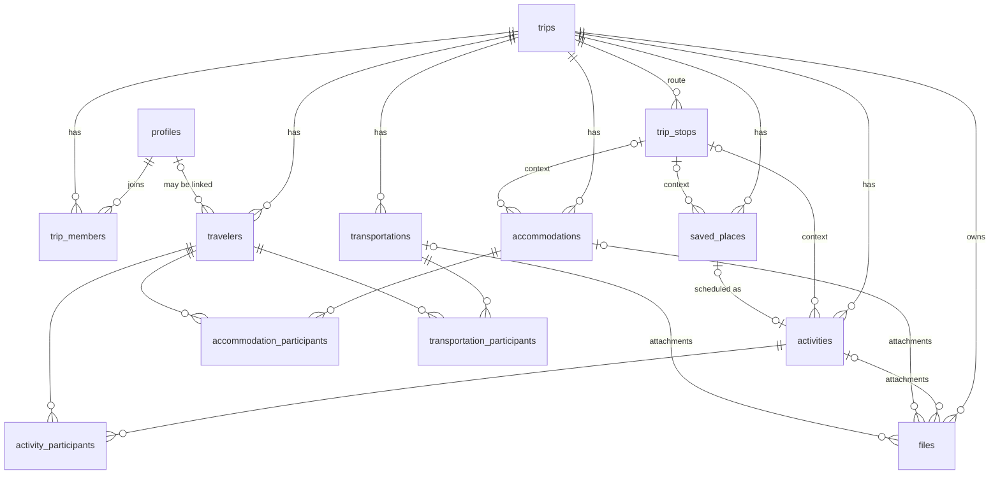

# Travio: data model (proposal v0)

> Status: **proposal v0, reviewed by Alberto on 2026-09-28** (decisions in section 6). It turns the conceptual model in `CLAUDE.md` into concrete tables, relationships and an RLS strategy. Nothing here is migrated yet.
>
> It is written at the PostgreSQL level on purpose, so it works whether we later choose an ORM or the Supabase client directly (still an open decision).

## 1. Entity overview



## 2. Cross-cutting decisions

### 2.1 `trip_id` on every row

Every trip-owned table carries `trip_id`, even when it could be reached through a parent (e.g. a file attached to an activity). Reasons:

- **RLS stays simple and fast**: every policy is "is the user a member of this row's `trip_id`?", with no joins through parents.
- Listing things per trip (all files, all activities) is a single indexed query.

### 2.2 Same-trip integrity with composite foreign keys

Carrying `trip_id` everywhere creates a risk: an activity in trip A pointing at a stop in trip B. We prevent it in the database, not just in the app:

```sql
-- each parent exposes (trip_id, id) as a unique key
alter table trip_stops add unique (trip_id, id);

-- the child references BOTH columns, so the stop must belong to the same trip
alter table activities
  add foreign key (trip_id, trip_stop_id)
  references trip_stops (trip_id, id)
  on delete set null (trip_stop_id);   -- PG15+: only null the stop, keep trip_id
```

The same pattern applies to every link between trip-owned rows (participants → travelers, files → activities, etc.).

### 2.3 Time and time zones

A trip crosses time zones (Mexico City → London → Krakow), and a flight departs in one zone and lands in another. Decision:

- Store instants as **`timestamptz`** (an absolute moment in time).
- Store the place's **IANA time zone** next to it (`Europe/London`), so the UI shows local time where the thing happens, not the phone's time zone.
- Activities store **`starts_at` + `duration_minutes`**; the end is **calculated**, never typed by the user.

`ends_at` is computed in the domain layer (and optionally exposed through a view), not as a generated column, because `timestamptz + interval` is not an immutable expression in PostgreSQL.

Trip dates (`start_date`, `end_date`) are plain `date`s: "6–20 Apr" is a calendar concept, not an instant.

### 2.4 Schedule conflicts are warnings, not constraints

The mockups let the user save an overlapping activity ("Puedes guardar igualmente"). So there is **no exclusion constraint** in the database. Conflict detection is a pure TypeScript domain function (activities in → conflicts out), easy to unit test and later extend with travel times.

### 2.5 Enumerations as `text` + `check`

Categories and types use `text` with a `check` constraint instead of PostgreSQL `enum` types. Adding a value to a check is a simple migration; changing a PG enum is more awkward. The TypeScript side mirrors them as union types.

### 2.6 Status is derived where possible

Trip "upcoming / active / past" (the filters in *Mis viajes*) is derived from `start_date`/`end_date` and today's date, not stored, so it can never go stale. "% planned" is also derived.

### 2.7 Booking status

Activities, accommodations and transportations have `booking_status text not null default 'planned'`:

| value | meaning | UI badge |
| --- | --- | --- |
| `planned` | in the plan, nothing booked yet (or no booking needed) | none |
| `booked` | reserved/paid, confirmation not received yet | "Reservada" |
| `confirmed` | confirmation/ticket in hand | "Confirmada" |

### 2.8 Money

`cost_amount numeric(12,2)` + `cost_currency char(3)` (ISO 4217). Never floats. Conversion between currencies is out of scope for v1.

### 2.9 Common columns

Every table has `id uuid primary key default gen_random_uuid()`, `created_at timestamptz default now()`, `updated_at timestamptz` (maintained by a trigger). Content tables also have `created_by uuid references profiles`.

## 3. Tables

### Identity and access

**`profiles`**: one row per authenticated user (created by a trigger on `auth.users`).

| column | type | notes |
| --- | --- | --- |
| id | uuid PK | = `auth.users.id` |
| display_name | text | |
| avatar_url | text | from Google, nullable |

**`trips`**

| column | type | notes |
| --- | --- | --- |
| name | text not null | "Europa 2026" |
| description | text | notes |
| start_date, end_date | date | nullable: a trip can exist before dates are known; check `end_date >= start_date` |
| cover_image_path | text | path in Storage, not a URL |
| currency | char(3) not null | default `'MXN'` |
| budget_amount | numeric(12,2) | estimated total, nullable (budget comes later) |
| created_by | uuid → profiles | |

**`trip_members`**: authorization. Links a **user** to a trip.

| column | type | notes |
| --- | --- | --- |
| trip_id | uuid → trips (cascade) | PK part |
| user_id | uuid → profiles (cascade) | PK part |
| role | text | `owner` \| `editor` \| `viewer` |

Exactly one owner per trip: `unique (trip_id) where role = 'owner'`.

Ownership is **transferable** through one database function, `transfer_trip_ownership(trip_id, new_owner_id)`, so it happens atomically: it checks that the caller is the current owner and the target is already a member, demotes the current owner to `editor`, then promotes the target (in that order, so the single-owner index is never violated).

**`travelers`**: people on the trip. **Not** authorization; a traveler doesn't need an account.

| column | type | notes |
| --- | --- | --- |
| trip_id | uuid → trips (cascade) | |
| name | text not null | "Alberto", "Acompañante" |
| user_id | uuid → profiles | nullable; `unique (trip_id, user_id)` |
| color | text | avatar chip color |

`trip_members` answers "what can this account do?"; `travelers` answers "who is going?". They meet only through the optional `user_id` link.

### Route

**`trip_stops`**

| column | type | notes |
| --- | --- | --- |
| trip_id | uuid → trips (cascade) | |
| name | text not null | "Londres" |
| google_place_id | text | nullable |
| lat, lng | double precision | nullable |
| timezone | text not null | IANA "Area/Location" or `UTC`, checked by `is_valid_timezone` (rejects `EST`, `UTC+3`) |
| arrives_on, departs_on | date | the stay, in local dates |
| position | int | route order; a trigger always appends new stops at the end; reorder with `move_trip_stop(stop_id, ±1)`, which swaps two stops inside one transaction (`unique (trip_id, position) deferrable`) |
| notes | text | |

### Itinerary

**`activities`**

| column | type | notes |
| --- | --- | --- |
| trip_id | uuid → trips (cascade) | |
| trip_stop_id | uuid | same-trip FK, `set null` |
| saved_place_id | uuid | same-trip FK, `set null`; set when created from a saved place (added with the saved places migration) |
| title | text not null | |
| category | text | `sightseeing` \| `tour` \| `food` \| `free_time` \| `nightlife` \| `shopping` \| `other` |
| starts_at | timestamptz not null | |
| duration_minutes | int not null | `check > 0` |
| timezone | text not null | defaults from the stop |
| location_name, address | text | |
| google_place_id | text | |
| lat, lng | double precision | |
| cost_amount, cost_currency | numeric, char(3) | |
| external_url | text | |
| reservation_ref | text | |
| booking_status | text | see 2.7 |
| notes | text | |

Index: `(trip_id, starts_at)`, which powers the timeline and conflict detection.

Ideas without a time are **saved places**, not activities. That keeps `starts_at` required and the timeline simple.

When a stop's `timezone` changes, the `trip_stops_sync_activity_time_zones` trigger rewrites its activities' `starts_at` so their **local** time stays the same (a 10:30 visit stays at 10:30 in the corrected zone). Deleting a stop keeps its activities (`trip_stop_id` becomes null, their own `timezone` stays).

**`accommodations`**: first-class, not an activity.

| column | type | notes |
| --- | --- | --- |
| trip_id, trip_stop_id | | same-trip FK |
| name | text not null | |
| address, google_place_id, lat, lng | | |
| check_in_at, check_out_at | timestamptz | `check (check_out_at > check_in_at)` |
| timezone | text not null | |
| booking_ref, booking_url | text | |
| booking_status | text | see 2.7 |
| cost_amount, cost_currency | | |
| notes | text | |

Check-in/check-out appear in the itinerary as **derived events** (a query/view), not as duplicated activity rows.

**`transportations`**

| column | type | notes |
| --- | --- | --- |
| trip_id | uuid | |
| type | text | `flight` \| `train` \| `bus` \| `ferry` \| `car_rental` \| `other` |
| origin_name, destination_name | text not null | |
| origin_place_id, destination_place_id | text | |
| departs_at / departs_timezone | timestamptz / text | |
| arrives_at / arrives_timezone | timestamptz / text | two zones: flights cross them |
| carrier | text | airline / operator |
| service_number | text | flight or train number |
| booking_ref, booking_url | text | |
| booking_status | text | see 2.7 |
| departure_detail, arrival_detail | text | "Terminal 5 · puerta B32", "andén 4" |
| cost_amount, cost_currency | | |
| notes | text | |

### Participation

`activity_participants`, `accommodation_participants`, `transportation_participants`: `(parent_id, traveler_id)` primary key, both same-trip FKs with cascade.

**No participant rows means "everyone".** Rows are only written when a subset of travelers takes part. Consequences:

- A traveler added to the trip later is automatically part of every "everyone" activity.
- If the user selects every traveler, the app stores **no rows** (normalizes back to "everyone"), so there is one representation per meaning.
- Filtering "Alberto's itinerary" = activities with no participant rows **or** with a row for Alberto. `transportation_participants` also has a **`seat`** column, because the seat belongs to the person, not to the flight.

### Saved places

**`saved_places`**: `trip_id`, `trip_stop_id`, `name`, `category`, `google_place_id`, `address`, `lat`, `lng`, `estimated_minutes` ("Aprox. 1 h"), `notes`. "Add to itinerary" creates an activity with `saved_place_id` pointing back; the saved place stays.

### Files (metadata only)

**`files`**: the binary lives in Supabase Storage; PostgreSQL stores **metadata**.

| column | type | notes |
| --- | --- | --- |
| trip_id | uuid → trips | permission anchor |
| uploaded_by | uuid → profiles | |
| bucket | text | `trip-files` |
| storage_path | text unique | `{trip_id}/{file_id}/{safe-filename}` |
| original_name | text | shown in the UI |
| mime_type | text | |
| size_bytes | bigint | |
| document_type | text | `flight` \| `train` \| `hotel` \| `tour` \| `ticket` \| `insurance` \| `other` (Documents screen grouping) |
| activity_id / accommodation_id / transportation_id | uuid | same-trip FKs, nullable, `set null` |

`check (num_nonnulls(activity_id, accommodation_id, transportation_id) <= 1)`: a file belongs to at most one entity; with none it is a trip-level document.

**Why explicit nullable FKs instead of a polymorphic `entity_type` + `entity_id` pair?** A polymorphic pair can't have a real foreign key, so the database can't guarantee the target exists or belongs to the same trip. Three nullable columns keep full integrity; the cost is one more column if a new attachable entity appears.

**Why the path starts with `trip_id`:** Storage RLS policies can read the first folder of the path and check trip membership without touching the `files` table.

**Deleting**: deleting an activity keeps its files as trip documents (`set null`). Deleting a `files` row does **not** delete the Storage object; that goes through a server action that removes both (to be designed in the storage slice).

## 4. Authorization (RLS strategy)

Roles, from `CLAUDE.md`: **owner** (everything), **editor** (content), **viewer** (read-only, including tickets).

### Helper functions

```sql
create function public.trip_role(p_trip_id uuid)
returns text
language sql stable
security definer            -- reads trip_members without triggering its own RLS (avoids recursion)
set search_path = ''
as $$
  select role from public.trip_members
  where trip_id = p_trip_id and user_id = auth.uid()
$$;

-- is_trip_member(trip_id) := trip_role(trip_id) is not null
-- can_edit_trip(trip_id)  := trip_role(trip_id) in ('owner', 'editor')
```

### Policies per table

| table | select | insert / update / delete |
| --- | --- | --- |
| trips | member, or `created_by = auth.uid()` * | insert: any authenticated user as `created_by`; update: editor+; delete: owner |
| trip_members | member | owner only (invitation flow still open) |
| travelers, trip_stops, activities, accommodations, transportations, saved_places, participants | member | editor+ |
| files | member | insert: editor+ with `uploaded_by = auth.uid()`; update/delete: editor+ |
| storage.objects (`trip-files`) | member of the path's trip | editor+ of the path's trip |

\* Creating a trip: a trigger inserts the creator as `owner` in `trip_members`. The `created_by` clause in the select policy is there because `insert ... returning` checks the select policy before that trigger's row is visible.

Other rules:

- The owner can't remove or demote themselves directly; ownership changes only through `transfer_trip_ownership`.
- Every policy targets the `authenticated` role; `anon` gets nothing.
- The bucket is **private**; files are opened via short-lived signed URLs created server-side.

## 5. Deferred (no tables yet)

- **Expenses / budget detail**: `expenses` table later; v1 only has costs on entities and `trips.budget_amount`.
- **Invitations**: depends on the invitation flow (open decision).
- **Weather**: fetched live, not stored.
- **Travel-time validation**: domain logic + Google APIs, no schema needed.

## 6. Decisions (reviewed with Alberto, 2026-09-28)

1. **Empty participants = everyone** (section 3, Participation).
2. **Exactly one owner per trip, transferable** via `transfer_trip_ownership`.
3. **Booking status** on activities, accommodations and transportations: `planned` / `booked` / `confirmed` (2.7).
4. **Deleting an entity keeps its files** as trip-level documents (`on delete set null`).
5. **Default currency `MXN`** for new trips.

Open, found while testing (2026-09-28): **what happens to a trip when its owner deletes their account?** Today the membership rows cascade away and `trips.created_by` becomes null, leaving a trip nobody can see. Options: block account deletion while owning trips with other members, auto-transfer to the oldest editor, or delete trips the user owns alone.

Still open (from `CLAUDE.md`): ORM vs Supabase client, invitation flow, whether editors can invite, file size/type limits, budget/expense schema.
